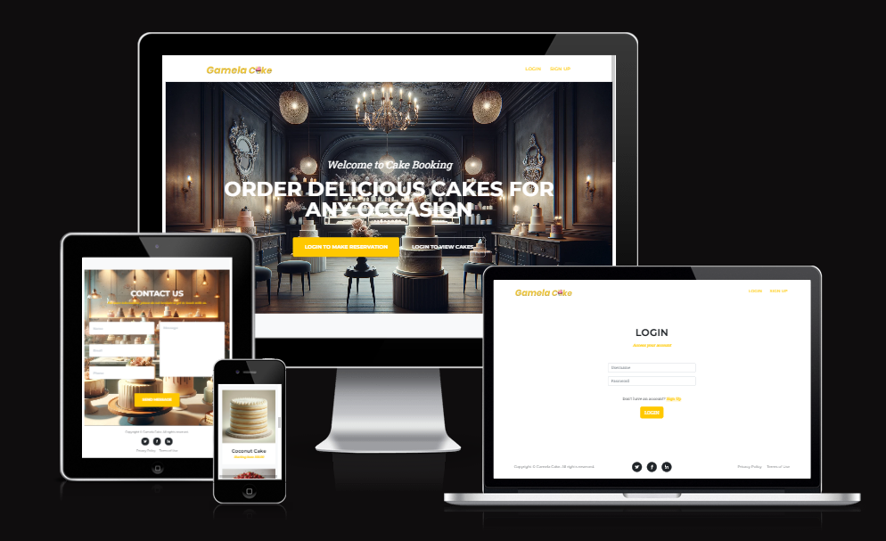
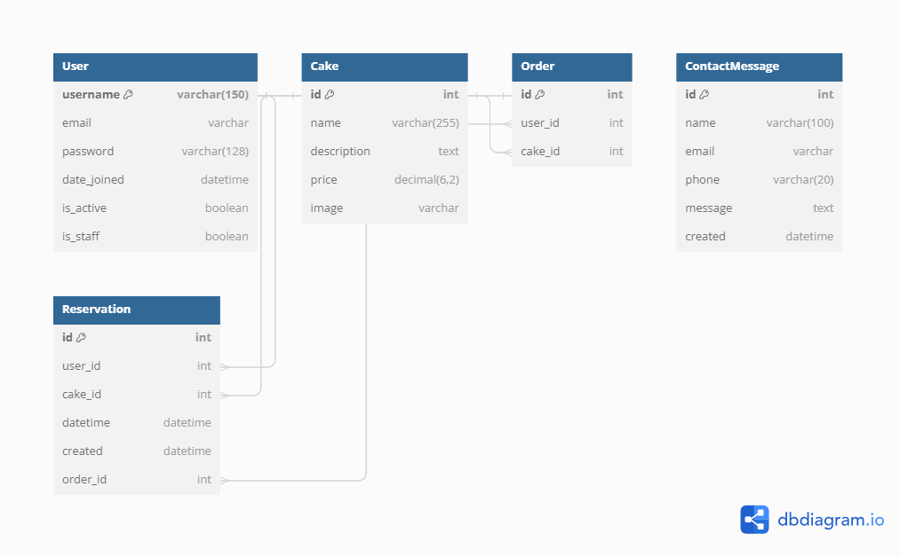
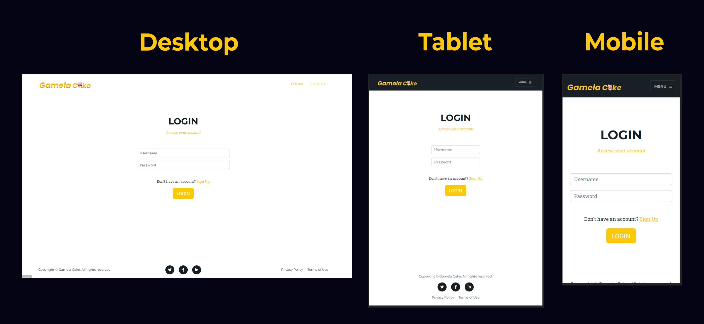
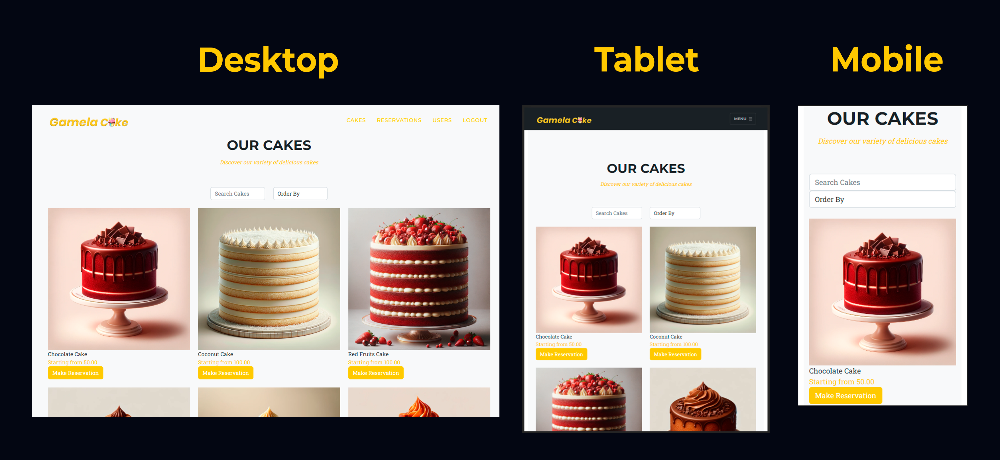
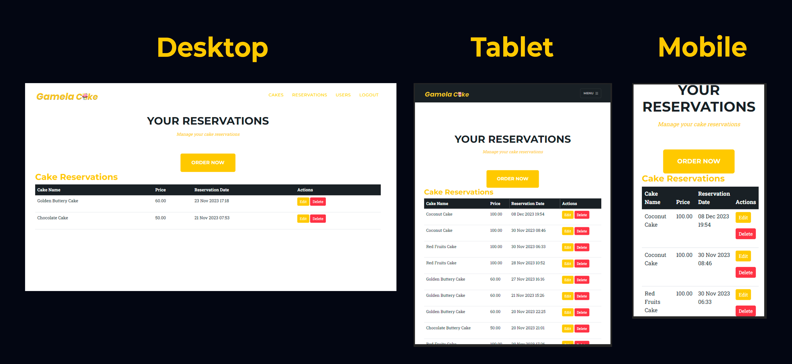

# Gamela Cake

## Overview
Welcome to Gamela Cake, an innovative cake reservation management platform that seamlessly integrates user-friendly features with sophisticated cake selection and booking systems. Designed to provide an effortless and enjoyable cake ordering experience, our platform offers a range of functionalities tailored to both casual browsers and serious confectionery enthusiasts.
[Here is the live version of the project](https://gamela-cake-5a01bc199f23.herokuapp.com/)

## User Story
Based on the objective of my website, I created this user story

### USER STORY: Make a Reservation
As a **customer** I can **select a date and time for my reservation** so that **planning is done well in advance.**

#### Acceptance Criteria

- The system must provide a calendar and clock interface for selecting a reservation date and time.
- The system must display the available time slots based on the bakery's operating hours and existing reservations.
- The menu must list all available cakes with descriptions and prices.
- The system must prevent a user from booking a time slot that is already reserved by another customer.
- The reservation process must be completed without system errors.

#### Task

- [x] Design a calendar and time selection interface.
- [x] Implement logic to fetch and display available time slots.
- [x] Create a dynamic menu display system with cake details and prices.
- [x] Develop a reservation conflict detection and prevention mechanism.
- [x] Integrate a reservation completion and error handling process.

### USER STORY: View Reservations
As a **customer** I can **view all my upcoming and past reservations,** so that **event management and reminiscence are straightforward.**

#### Acceptance Criteria

- The system must provide a personal dashboard where a customer can view all their upcoming and past reservations.
- The dashboard must display the date, time, and details of the cakes ordered for each reservation.
- Past reservations must be clearly distinguished from upcoming ones.

#### Task

- [x] Develop a user dashboard to display reservation details.
- [x] Implement filters to separate upcoming and past reservations.
- [x] Ensure the dashboard pulls and displays accurate reservation data.

### USER STORY: Modify a Reservation
As a **customer** I can **change the date, time, and cake options for my reservation,** so that **adjustments to plans are accommodated.**

#### Acceptance Criteria

- The system must allow changes to the date, time, and cake selection up to a certain cut-off time before the reservation.
- Any modifications must be confirmed by the customer and acknowledged by the system through an updated confirmation.

#### Tasks 

- [x] Create a feature to edit reservation details within the user dashboard.
- [x] Implement business logic to handle cut-off times for modifications.
- [x] Set up a confirmation system for any changes made to a reservation.

### USER STORY: Cancel a Reservation
As a **customer** I can **cancel my reservation,** so that **changes in plans are easily handled without penalty.**

#### Acceptance Criteria

- The system must allow a reservation to be cancelled up to a certain cut-off time before the reservation date.
- The customer must receive a cancellation confirmation via email.
- No penalty must be charged if the cancellation is made within the permitted time frame.

#### Tasks

- [x] Develop a cancellation feature within the user dashboard.
- [x] Implement business logic for cancellation cut-off times.
- [x] Integrate an email system to send cancellation confirmations.

### USER STORY: User Registration
As a **guest** I can **create an account in the system,** so that **booking and event management are enabled.**

#### Acceptance Criteria

- The registration form must capture essential information such as name, email, and password.
- The system must validate the email address format and password strength.
- Upon successful registration, the user must be directed to their personal dashboard.

#### Tasks

- [x] Design a user registration form.
- [x] Implement form validation for email and password fields.
- [x] Set up a user authentication system to handle new registrations.

### USER STORY: User Login
As a ** registered user** I can ** log in to the system,** so that **access to personal information and reservations is secured.**

#### Acceptance Criteria

- The login process must authenticate users based on their email and password.
- The system must provide error messages for incorrect login credentials.
- Upon successful login, the user must be directed to their personal dashboard.

#### Tasks

- [x] Design a user login form.
- [x] Implement authentication logic to verify user credentials.
- [x] Develop a session management system to handle user logins and redirects.

### USER STORY: View Menu
As a **customer** I can **view a cake menu** so that **informed decisions about product selection are made.**

#### Acceptance Criteria

- The menu must list all cakes with images, descriptions, and prices.
- The menu must be accessible to all users, registered or not.
- The menu must be updated in real-time to reflect any changes in cake availability or prices.

#### Tasks

- [x] Design a layout for the cake menu.
- [x] Implement a system to retrieve and display real-time data for cakes.
- [x] Ensure the menu is accessible and navigable for all users.

### USER STORY: Select Cakes
As a **customer** I can ** add cakes from the menu to my reservation,** so that **the order meets the event's requirements.**

#### Acceptance Criteria:

- The system must allow users to add cakes to their reservation from the menu.
- The system must update the reservation summary in real-time as cakes are added or removed.
- The system must provide an option to review the final selection before confirming the reservation.

#### Tasks

- [x] Develop a feature to add cakes to a reservation.
- [x] Implement real-time updates to the reservation summary.
- [x] Design a review page for final order confirmation.

### USER STORY: Receive Reservation Confirmation
As a **customer** I can **receive immediate email confirmation after making a reservation,** so that **confirmation of booking is ensured.**

#### Acceptance Criteria

- The system must send an email confirmation immediately after a reservation is made.
- The email must include the reservation date, time, and details of the cakes ordered.
- The email must provide a reservation number for reference.

#### Tasks

- [ ] Set up an automated email system for reservation confirmations.
- [ ] Design email templates for confirmation messages.
- [ ] Implement a reservation reference system.

#### USER STORY: Reservation Reminders
As a **customer** I can ** receive reminders of my upcoming reservation,** so that ** the event is remembered and attended.**

#### Acceptance Criteria

- The system must send an email reminder 24 hours before the reservation date.
- The reminder must include the reservation date, time, and location.
- The reminder must provide an option to modify or cancel the reservation.

#### Tasks

- [ ] Integrate an automated email reminder system.
- [ ] Design reminder email templates.
- [ ] Implement a feature for users to modify or cancel reservations from the reminder email.

## Skeleton 

### Database Schema

This section provides an overview of the database schema used in our application. The schema includes five main tables: User, Cake, Order, ContactMessage, and Reservation. Each table is designed to store specific information related to our cake reservation system.

## Features

### Landing Page - Before and After Login

### Cake List Section

### Contact Section

### Footer

### Login Page

### Signup Page

### Cake Page

### Reservation Page

### Cake Booking Page

### Edit Reservation Page

### Delete Reservation Page

### User Page

### Existing Features

## Future Improvements

## Testing

### Testing Steps

### Testing Bug

### Remaining Bugs

### Validator Testing
**PEP8CI**
**jshint**

## Deployment

### Deployment Bugs

## Credits

### Content

### Media
- Screenshot of the responsive where taken from [ui.dev](https://ui.dev/amiresponsive?url=https://gamela-cake-5a01bc199f23.herokuapp.com/reservations/).
- DALL·E for image generated
- Adobe Photoshop to create Gamela Cake logo

### Language Used
- TECHNOLOGIES: 
    - HTML5: To build the main structure of the site
    - CSS3:  To style the website with bootstrap
    - JAVASCRIPT: For the frontend interactivity
        - Shrink and Collapse the navbar when the page is scrolled
        - Setup for the confirmation modal
        - Flatpickr setup for date and time selection
        - For date selection
        - To handle reservation confirmation
        - To get a cookie value by name
        - To checks for new messages and hides them after 2 seconds
    - PYTHON: To build the backend with django
- FRAMEWORKS: DJANGO, JQUERY, BOOTSTRAP
- VERSION CONTROL: GIT, GITHUB

### DATABASES
- [Elephantsql](https://www.elephantsql.com/)

### Codes
- Multi-line Docstrings from [Python Docstrings](https://www.geeksforgeeks.org/python-docstrings/)
- Use the [Cloudinary](https://cloudinary.com/documentation/django_integration) documentation for is better integration in django
- Write with a proper PEP 8 guidance [Real Python](https://realpython.com/python-pep8/#maximum-line-length-and-line-breaking)
- Use Bootstrap [Cheatsheet](https://getbootstrap.com/docs/5.0/examples/cheatsheet/) to better style
- Use StartBootstrap [Agancy](https://startbootstrap.com/theme/agency) templates

### Deployment
- Use Code Institute [Django Deployment Instructions](https://docs.google.com/document/d/1P5CWvS5cYalkQOLeQiijpSViDPogtKM7ZGyqK-yehhQ/edit#heading=h.5s9novsydyp1)
- Heroku

### Mentor
- [Can Sücüllü](https://github.com/cansucullu) were consulted during the development process.